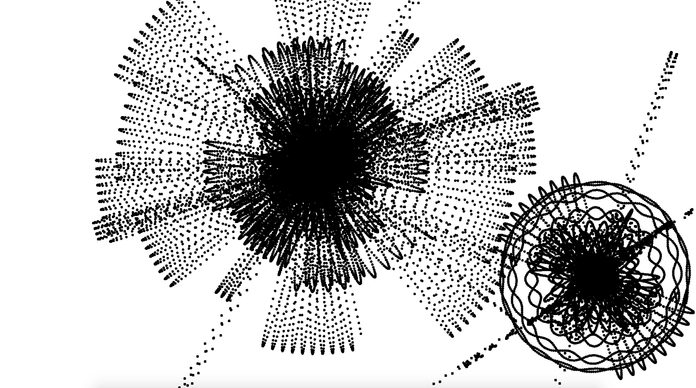

# Drawing with Particle Systems in Processing.py 
 
The image above was made using this repository!  
***Install***  
Download [Processing](https://processing.org/download/)   
Clone this repository onto your machine  
 `git clone https://github.com/ShepSims/processing`  
Open ParticleSystem.pyde with Processing

Select Run and have some fun!  

***Controls***  
Up - Adds more particles to the system 
Down - Removes most recently added particles 
Left - Decreases particle growth rate 
Right - Increases particle growth rate 

g - invert gravity 

f - tracer mode 
l - line mode 
d - dot mode 

s - takes a screenshot and saves as .tiff in ../ParticleSystem/data 

c - clears the screen 

